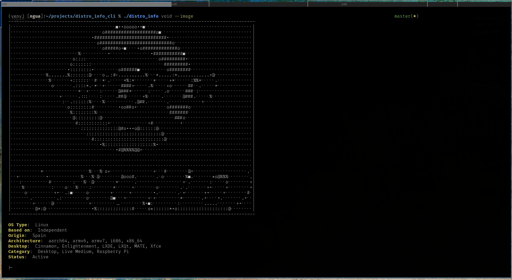

## distro_info_cli
#### Look up Linux and BSD distros from the terminal

Have you ever been _desperate_ to learn more about FOSS operating systems, but couldn't fathom opening a browser and navigating all the way to [distrowatch](https://distrowatch.com)? Enter distro_info_cli - a terminal-based reference for Linux and BSD distros. distro_info makes a request to distrowatch and parses the results with [bs4](https://launchpad.net/beautifulsoup). It optionally presents an ASCII representation of distro logos.

## Installation and Usage
Assuming you use `pip`:
```
pip -r requirements.txt
chmod +x distro_info
./distro_info <distro>
```

To display an ASCII representation of the given distro:
```
./distro_info <distro> --image
```

Tested on Arch.

## Screenshot


